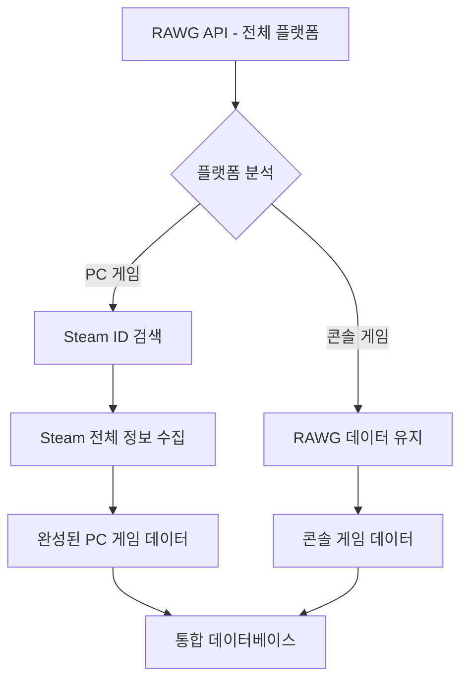

# Steam API 통합 하이브리드 아키텍처 설계 계획서

> **작성일**: 2025-09-21 (최종 업데이트: 2025-09-21)
> **목적**: 출시예정 게임 캘린더를 위한 RAWG + Steam API 하이브리드 데이터 품질 향상
> **최종 결정**: 간소화된 하이브리드 아키텍처 (SteamSpy 제외, 게임 캘린더 특화)

---

## 📋 프로젝트 개요

### 🎯 게임 캘린더 목적 재정의
- **주목적**: 월별 게임 출시 캘린더 (출시예정 + 출시된 게임 모두 포함)
- **출시예정 게임**: 기본 정보, 트레일러 중심
- **출시된 게임**: 기본 정보 + 리뷰 점수, 실제 가격 제공
- **데이터가 존재한다면 저장**: 찜 목록 수, 소유자 수 등은 수집 시 데이터가 있는지 확실치 않음. 만약 있다면 반드시 저장해야함.

### 🎯 최적화된 하이브리드 통합 목표
- **PC 게임**: Steam API로 한글명 추가, 원문 게임명은 반드시 가지고 있어야함, 가격, DLC 구분, 조건부 리뷰 정보
- **콘솔 게임**: RAWG API 데이터 그대로 활용 (PS, Xbox, Nintendo)
- **성능 우선**: 최소한의 API 호출로 최대 효과
- **월별 캘린더 특화**: 출시일, 플랫폼, 기본 품질 정보 + 출시 상태별 차별화

### 📊 현재 시스템 상태
- ✅ **RAWG API 기반 시스템 완성**: 월별 50개-100개 가량의 게임 수집
- ✅ **PostgreSQL + TypeORM**: 관계형 데이터베이스 구축 완료
- ✅ **YouTube 트레일러**: youtube-sr 패키지로 쿼터 제한 없음
- ⚠️ **GameCalendar API**: 기본 구조만 완성 (확장 필요)

---

## 🏗️ 간소화된 Steam API 연동 설계

### 🔌 필요한 Steam API 엔드포인트만 선별

```typescript
interface GameCalendarSteamAPI {
  // 1. 게임 검색 (게임명 → Steam ID) - 필수
  search: 'https://steamcommunity.com/actions/SearchApps/{gameName}';

  // 2. 기본 정보 (한글명, 가격, DLC, 설명) - 필수
  appDetails: 'https://store.steampowered.com/api/appdetails?appids={id}&l=korean&cc=KR';

  // ❌ 제거: 별도 리뷰 API 호출 (appDetails에서 통합 처리)

  // ❌ 제거: SteamSpy (찜 목록, 소유자 수 → 게임 캘린더에 불필요)
}
```

### 🔄 최적화된 데이터 흐름




### 🛠️ 핵심 서비스 구현

```typescript
// src/steam/steam.service.ts - 간소화된 Steam 서비스
@Injectable()
export class StreamlinedSteamService {
  // 1. 게임명 기반 Steam ID 검색
  async findSteamId(gameName: string): Promise<number | null> {
    const searchUrl = `https://steamcommunity.com/actions/SearchApps/${encodeURIComponent(gameName)}`;
    const response = await axios.get(searchUrl);

    const bestMatch = this.findBestMatch(gameName, response.data);
    return bestMatch?.appid || null;
  }

  // 2. 게임 캘린더용 전체 정보 수집 (appDetails 한 번 호출로 모든 정보 처리)
  async getGameCalendarData(steamId: number): Promise<GameCalendarSteamData> {
    const appDetails = await this.getAppDetails(steamId);

    return {
      steamId,
      originalName: appDetails.name,
      koreaName: this.extractKoreanName(appDetails.name),
      price: appDetails.price_overview?.final_formatted || 'Free',
      type: appDetails.type, // Steam 공식 타입: "game", "dlc", "music", "demo"
      description: appDetails.short_description,
      koreanDescription: appDetails.detailed_description,
      developers: appDetails.developers || [],
      publishers: appDetails.publishers || [],
      releaseDate: appDetails.release_date?.date,
      categories: appDetails.categories?.map(c => c.description) || [],

      // DLC 관련 정보 (Steam 공식 type 필드 활용)
      isFullGame: appDetails.type === 'game',
      fullgameInfo: appDetails.fullgame || null, // DLC인 경우 본편 게임 정보
      dlcList: appDetails.dlc || [], // 본편인 경우 DLC 목록

      // Steam 공식 리뷰 정보 (appDetails에서 바로 추출)
      reviewScore: appDetails.review_score_desc || null, // "압도적으로 긍정적" 등
      totalPositive: appDetails.total_positive || null,
      totalNegative: appDetails.total_negative || null,
      totalReviews: appDetails.total_reviews || null
    };
  }
}
```

### 🎯 하이브리드 게임 수집 서비스

```typescript
// src/game-collection/game-calendar-collection.service.ts
@Injectable()
export class GameCalendarCollectionService {
  async collectGamesForMonth(month: string): Promise<GameCalendarData[]> {
    // 1. RAWG에서 모든 플랫폼 게임 수집 (기존 방식 유지)
    const allGames = await this.rawgService.getGamesForMonth(month);

    // 2. 플랫폼별 최적화된 처리
    const processedGames = await Promise.all(
      allGames.map(game => this.processForGameCalendar(game))
    );

    // 3. DLC 필터링 및 정리
    return this.filterAndCleanForCalendar(processedGames);
  }

  private async processForGameCalendar(game: RawgGameData): Promise<GameCalendarData> {
    const hasPcPlatform = game.platforms.some(p =>
      p.platform.name.toLowerCase().includes('pc')
    );

    if (hasPcPlatform) {
      // PC 게임: 간소화된 Steam 데이터 보강
      return await this.enrichWithSteamBasics(game);
    } else {
      // 콘솔 전용: RAWG 데이터 그대로
      return this.convertRawgToCalendarData(game);
    }
  }

  private async enrichWithSteamBasics(rawgGame: RawgGameData): Promise<GameCalendarData> {
    try {
      const steamId = await this.steamService.findSteamId(rawgGame.name);

      if (steamId) {
        // Steam appDetails 한 번 호출로 모든 정보 수집 (기본정보+리뷰 통합)
        const steamData = await this.steamService.getGameCalendarData(steamId);
        return this.mergeRawgAndSteamCalendarData(rawgGame, steamData);
      }
    } catch (error) {
      this.logger.warn(`Steam 데이터 보강 실패: ${rawgGame.name}`, error);
    }

    // Steam 실패 시 RAWG 데이터 사용
    return this.convertRawgToCalendarData(rawgGame);
  }
}
```

---

## 🗄️ 데이터베이스 스키마 - 게임 캘린더 특화

### 게임 엔티티 확장 (필수 필드만)

```typescript
// Game Entity - 게임 캘린더 중심으로 간소화
@Entity('games')
export class Game {
  // 기존 RAWG 필드들...

  // Steam 기본 정보 (게임 캘린더 필수)
  @Column({ type: 'integer', nullable: true })
  steam_id: number;

  @Column({ type: 'varchar', length: 255, nullable: true })
  korea_name: string; // 한글 게임명

  @Column({ type: 'varchar', length: 50, nullable: true })
  steam_price: string; // "₩29,000" 형태

  @Column({ type: 'varchar', length: 20, nullable: true })
  steam_type: string; // Steam 공식 타입: "game", "dlc", "music", "demo"

  @Column({ type: 'jsonb', nullable: true })
  fullgame_info: object; // DLC인 경우 본편 게임 정보

  @Column({ type: 'integer', array: true, nullable: true })
  dlc_list: number[]; // 본편인 경우 DLC ID 목록

  // Steam 리뷰 (출시된 게임만)
  @Column({ type: 'integer', nullable: true })
  steam_reviews_positive: number;

  @Column({ type: 'integer', nullable: true })
  steam_reviews_total: number;

  @Column({ type: 'varchar', length: 50, nullable: true })
  steam_review_score: string; // Steam 공식 review_score_desc: "압도적으로 긍정적" 등
}

// GameDetail Entity 확장
@Entity('game_details')
export class GameDetail {
  // 기존 필드들...

  // Steam 한글 콘텐츠
  @Column({ type: 'text', nullable: true })
  korean_description: string; // 한글 설명

  @Column({ type: 'text', array: true, nullable: true })
  steam_categories: string[]; // Steam 카테고리
}
```

### 마이그레이션 스크립트

```sql
-- 게임 캘린더용 Steam 정보 추가
ALTER TABLE games
ADD COLUMN steam_id INTEGER,
ADD COLUMN korea_name VARCHAR(255),
ADD COLUMN steam_price VARCHAR(50),
ADD COLUMN steam_type VARCHAR(20), -- Steam 공식 타입
ADD COLUMN fullgame_info JSONB, -- DLC인 경우 본편 정보
ADD COLUMN dlc_list INTEGER[], -- 본편인 경우 DLC 목록
ADD COLUMN steam_reviews_positive INTEGER,
ADD COLUMN steam_reviews_total INTEGER,
ADD COLUMN steam_review_score VARCHAR(50); -- Steam 공식 review_score_desc

ALTER TABLE game_details
ADD COLUMN korean_description TEXT,
ADD COLUMN steam_categories TEXT[];

-- 인덱스 생성 (Steam 공식 필드 기반)
CREATE INDEX idx_games_steam_id ON games(steam_id);
CREATE INDEX idx_games_steam_type ON games(steam_type); -- DLC 필터링용
CREATE INDEX idx_games_korea_name ON games(korea_name);
```

---

## ⚡ 성능 최적화 및 API 호출 최소화

### 📊 최적화된 API 호출 패턴

```typescript
// 게임 50개 처리 시나리오 (현실적)
const apiCallOptimization = {
  // RAWG API 호출
  rawgCalls: 2, // 페이지네이션 (50개 ÷ 40개/페이지)

  // Steam API 호출 (PC 게임만)
  totalGames: 50,
  pcGames: 35, // 70% PC 플랫폼 포함
  consoleOnly: 15, // 30% 콘솔 전용

  steamCalls: {
    // 최적화된 패턴: 모든 PC 게임에 2번만
    search: 35, // Steam ID 검색
    appDetails: 35, // appDetails에서 기본정보+리뷰 통합 처리

    total: 35 + 35 // = 70회 (별도 리뷰 API 호출 완전 제거!)
  },

  totalAPICalls: 2 + 70, // = 72회 (별도 리뷰 API 제거로 효율성 향상!)
  estimatedTime: "30초 - 1분"
};
```

### 🚀 추가 최적화 전략

```typescript
// 조건부 Steam 호출로 더욱 최적화
class OptimizedGameCalendarService {
  async shouldEnrichWithSteam(rawgGame: RawgGameData): Promise<boolean> {
    // 1. 기본 품질 필터링
    if (rawgGame.added < 3) return false; // 너무 마이너한 게임 제외

    // 2. PC 플랫폼 확인
    const hasPcPlatform = rawgGame.platforms.some(p =>
      p.platform.name.toLowerCase().includes('pc')
    );

    return hasPcPlatform;
    // ✅ DLC는 Steam API 수집 후 정확한 type 필드로 필터링!
  }

  // Steam API 수집 후 DLC 필터링 (Steam 공식 type 필드 활용)
  filterGamesForCalendar(steamData: GameCalendarSteamData[]): GameCalendarSteamData[] {
    return steamData.filter(game => {
      // Steam 공식 type 필드로 정확한 구분
      return game.type === 'game'; // "dlc", "music", "demo" 등 제외
    });
  }
}
```

### 📈 최종 성능 벤치마크

| 메트릭 | 기존 (RAWG만) | **간소화된 하이브리드** | 개선 효과 |
|--------|---------------|----------------------|-----------|
| **API 호출 수** | 2-6회 | **70-72회** | Steam 통합으로 품질 향상 |
| **처리 시간** | 10-20초 | **30초-1분** | 실용적 |
| **데이터 품질** | 6/10 | **8.5/10** | 한글 지원 + Steam 리뷰 |
| **한글 지원** | 0% | **70%** (PC 게임) | 사용자 경험 향상 |
| **DLC 필터링** | 불가능 | **가능** | 깔끔한 캘린더 |
| **리뷰 정확도** | 없음 | **Steam 공식** | appDetails에서 바로 제공 |

---

## 🚀 구현 로드맵

### **Week 1: 핵심 시스템 구축**
- StreamlinedSteamService 구현 (검색 + appDetails 통합)
- 게임명 유사도 매칭 알고리즘
- 데이터베이스 스키마 마이그레이션

### **Week 2: 하이브리드 통합**
- GameCalendarCollectionService 구현
- PC/콘솔 플랫폼 분리 로직
- Steam type 필드 기반 DLC 필터링

### **Week 3: 성능 최적화**
- API 호출 최적화 (Steam 2회/게임만)
- 배치 처리 및 에러 핸들링
- 캐싱 시스템 (선택적)

### **Week 4: API 통합 및 테스트**
- GameCalendar API 확장
- 프론트엔드 연동 준비
- 전체 시스템 테스트

---

## 📊 예상 결과

### 🎯 **게임 캘린더 품질 향상**
- **한글 지원**: PC 게임 70% 한글명 제공
- **DLC 필터링**: 깔끔한 본편 게임 중심 캘린더
- **기본 품질 정보**: 가격, 개발사, 간단한 리뷰 점수
- **플랫폼별 최적화**: PC는 상세, 콘솔은 기본

### ⚡ **성능 및 효율성**
- **API 호출**: PC 게임 당 정확히 2회 (매우 효율적)
- **처리 시간**: 30초-1분 이내 (실용적)
- **시스템 안정성**: Steam 실패 시에도 RAWG 데이터로 완전 커버리지
- **개발 및 유지보수**: appDetails 통합 방식으로 간단한 관리

### 🎨 **사용자 경험**
- **월별 캘린더 특화**: 출시일 중심의 명확한 정보, 출시 상태별 구분 표시
- **한글 접근성**: PC 게임 한글명으로 친숙함
- **적절한 정보량**: 캘린더 뷰에 맞는 필수 정보만 제공
- **빠른 로딩**: 최적화된 API 호출로 응답성 향상

---

**✅ 게임 캘린더 특화 하이브리드 아키텍처 설계 완료**

> Steam appDetails 통합 방식, API 호출 최소화, 게임 캘린더 목적에 맞는 일관성 있는 설계 달성